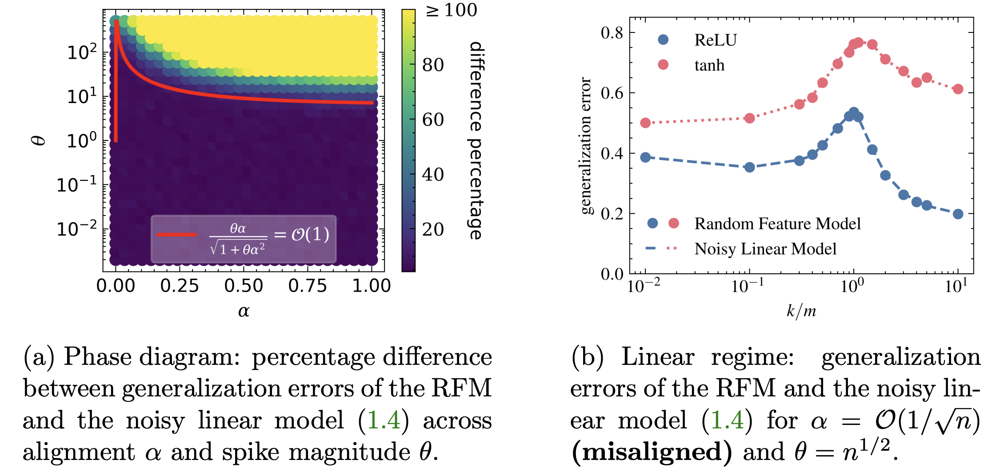
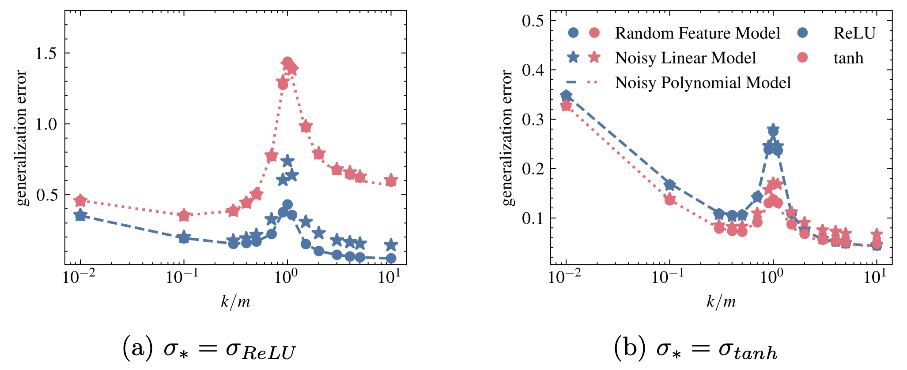
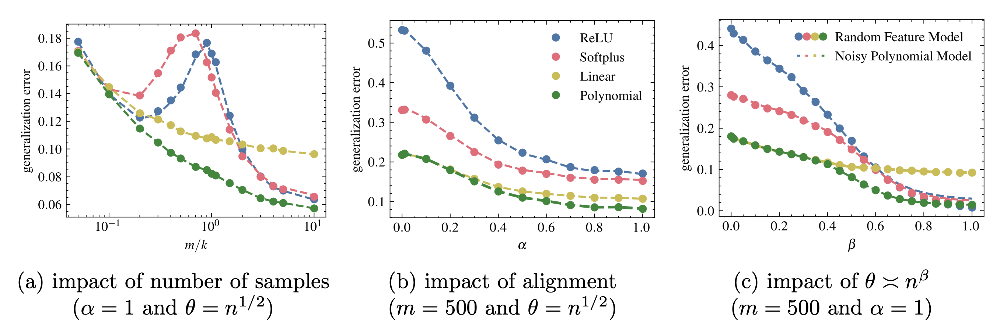
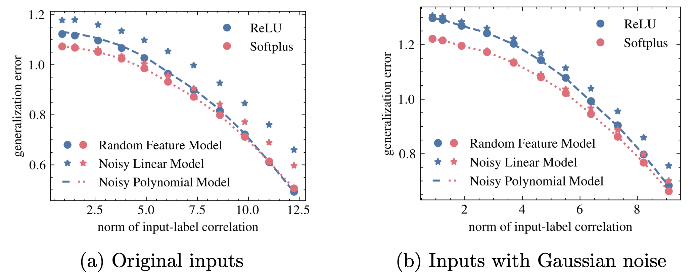

# Input–Label Correlation Governs a Linear-to-Nonlinear Transition in Random Features under Spiked Covariance
Code for the SIMODS paper called "Input–Label Correlation Governs a Linear-to-Nonlinear Transition in Random Features under Spiked Covariance"

### [Paper Link](https://arxiv.org/abs/2409.20250)
### Samet Demir, Zafer Dogan

## Running the Code
- The code is written with Python 3 inside Jupyter Notebook (.ipynb) files. Each file corresponds to experiments/simulations for one of the figures (names of the files are self-explanatory). So, each figure can be reproduced by running the code inside the corresponding Jupyter Notebook (.ipynb).

- Required packages: numpy, jax, tqdm, scipy, matplotlib, SciencePlots

## Abstract

Random feature models (RFMs)—two-layer networks with a randomly initialized fixed first layer and a trained linear readout—are among the simplest nonlinear predictors. Prior asymptotic analyses in the proportional high-dimensional regime show that, under isotropic data, RFMs reduce to noisy linear models and offer no advantage over classical linear methods such as ridge regression. Yet RFMs frequently outperform linear baselines on structured real data. We show that this tension is explained by a correlation-driven phase transition: under spiked-covariance designs, the interaction between anisotropy and input–label correlation determines whether the RFM behaves as an effectively linear predictor or exhibits genuinely nonlinear gains. Concretely, we establish a universality principle under anisotropy and characterize the RFM generalization error via an equivalent noisy polynomial model. The effective degree of this polynomial—equivalently, which Hermite orders of the activation survive—is governed by the strength of input–label correlation, yielding an explicit boundary in the correlation–spike-magnitude plane. Below the boundary, the RFM collapses to a linear surrogate and can underperform strong linear baselines; above it, higher-order terms persist and the RFM achieves a clear nonlinear advantage. Numerical simulations and real-data experiments corroborate the theory and delineate the transition between these two regimes.

## Results
### Figure 1: The phase boundary in the correlation–spike-magnitude plane, and the linear regime where the RFM matches the noisy linear model
<p align="center">
  
</p>

### Figure 2: The nonlinear side of the phase boundary, where the noisy polynomial model captures the RFM generalization error
<p align="center">
  
</p>

### Figure 3: Comparison of activation functions with respect to number of samples, alignment, and spike magnitude
<p align="center">
  
</p>

### Figure 4: The phase transition on real data (CIFAR-10) with controlled input–label correlation, without and with added Gaussian noise
<p align="center">
  
</p>

## Citation
```
@article{demir2026input,
author = {Demir, Samet and Dogan, Zafer},
title = {Input-Label Correlation Governs a Linear-to-Nonlinear Transition in Random Features Under Spiked Covariance},
journal = {SIAM Journal on Mathematics of Data Science},
year = {2026}
}
```
